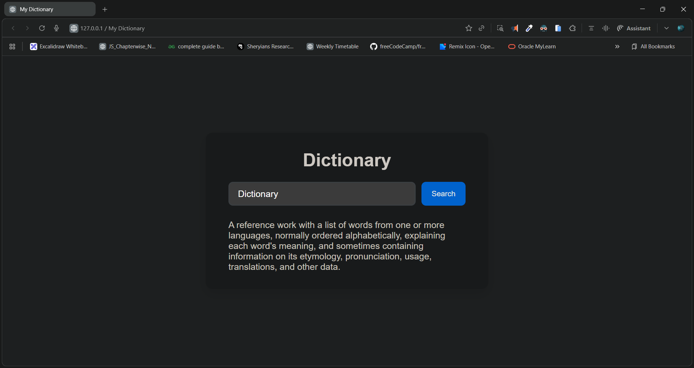

# 📘 My Dictionary

A sleek and simple **online dictionary web app** built using **HTML**, **CSS**, and **JavaScript**.  
It allows users to quickly look up English word meanings using the [Free Dictionary API](https://dictionaryapi.dev/).

---

## 🌐 Live Demo

👉 **[View Live Project](https://dileep-kumawat.github.io/Dictionary-using-html-css-and-js/)**  



---

## 🎥 Demo Video

Watch how it works:  
📺 **[Demo Video](./demo.mp4)**

---

## 🚀 Features

- 🔍 Real-time dictionary lookup
- 💬 Fetches word meanings using a public API
- ⚡ Fast, clean, and responsive UI
- 🎨 Modern, minimal design built with CSS
- 💻 Keyboard “Enter” key support for instant search

---

## 🧩 Tech Stack

- **HTML5** – Structure
- **CSS3** – Styling and layout
- **JavaScript (ES6)** – API integration and interactivity
- **[DictionaryAPI.dev](https://dictionaryapi.dev/)** – Free dictionary API

---

## 🛠️ Setup & Installation

1. Clone this repository:
   ```bash
   git clone https://github.com/Dileep-kumawat/Dictionary-using-html-css-and-js.git

2. Navigate into the project folder:

   ```bash
   cd my-dictionary
   ```
3. Open `index.html` in your browser:

   ```bash
   open index.html
   ```

   or simply drag and drop it into your browser window.

---

## 📖 Usage

1. Type a word into the input box.
2. Click **Search** or press **Enter**.
3. The app will display the meaning of the word.
4. If no word is found, an error message will appear.

---

## 🧠 Example

**Input:** `hello`
**Output:** “An expression or gesture of greeting — used when meeting someone.”

---

## 🖼️ Project Structure

```
my-dictionary/
├── index.html      # Main structure
├── style.css       # Styles and layout
└── script.js       # App logic and API integration
```

---

## 💡 Future Improvements

* 📚 Add pronunciation and phonetic symbols
* 🔊 Add audio pronunciation
* 🧩 Include examples and synonyms
* 🌙 Add dark mode support

---

## 🧑‍💻 Author

👤 **Dileep kumawat**
- 📧 [dileepkumawat525@gmail.com](mailto:dileepkumawat525@gmail.com)
- 🔗 [LinkedIn](https://www.linkedin.com/in/dileep-kumawat/)

---

## 📜 License

This project is open-source and available under the [MIT License](LICENSE).